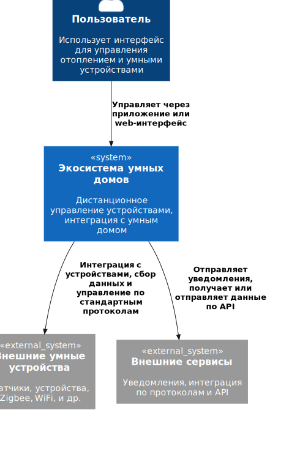

# Project_template

Это шаблон для решения проектной работы. Структура этого файла повторяет структуру заданий. Заполняйте его по мере работы над решением.

# Задание 1. Анализ и планирование

<aside>

Чтобы составить документ с описанием текущей архитектуры приложения, можно часть информации взять из описания компании и условия задания. Это нормально.

</aside

### 1. Описание функциональности монолитного приложения

**Управление отоплением:**

- Пользователи могут управлять отоплением в доме через датчик отопления.
- Система поддерживает синхронную передачу значения температуры от клиента и к датчику. 
- Новые датчики необходимо подключать специалисту.

**Мониторинг температуры:**

- Пользователи могут проверять температуру.
- Система поддерживает синхронную передачу данных от датчика к клиенту. 
- Новых пользователей необходимо подключать специалисту.

### 2. Анализ архитектуры монолитного приложения

Архитектура приложения представляет из себя монолит на Go с СУБД Postgres. Все вызовы к API осуществляются синхронно.
Возможность самостоятельного подключения к сервису, добавление новых дачтиков остутсвует.

### 3. Определение доменов и границы контекстов

Домены (As-Is):
- управление отоплением (получение текущих данных, передача данных для установки температуры);
- логистика и монтаж (расписание и выезд специалистов для монтажа новых датчиков/подключения новых клиентов).

Домены (To-Be):
- управление умным домом (подключение пользователем любых устройств, а не только датчиков темпераутры, по стандартным/поддерживаемым протоколам);
- умные устройства (поддержка распространенных стандартов умного дома/устройств);
- контроль доступа (самостоятельная регистарция, авторизация, формирование прав доступа к системе);
- мониторинг (домен/поддомен считывания текущих параметров в разрезе датчика/клиента, навешивание триггеров?, уведомление пользователей об изменении значений).

Контексты (As-Is):
- управление отоплением (термины: температура, текущее значение температуры, новое значение температуры, мониторинг тепературы на клиенте, получение текущего значения температры устройства);
- логистика и монтаж (термины: специалист, установка нового датчика, подключение нового клиента, адрес, расписание);

Контексты (To-Be):
- управление умным домом (термины: устройства, добавление/удаление устройств через интерфейс, настройка и получение данных);
- управление мониторингом (термины: мониторинг, уведомления, сравнение значений)
- умные устройства (термины: стандарты умных устройств, API, производители);
- контроль доступа (термины: интерфейс, пользователь, правда, логин, пароль, регистрация, подключение, добавление/удаление устройства).


### **4. Проблемы монолитного решения**

- Масшатбирование невозможно в текущем виде.
- Поддержка и/или расширение без остановки сервиса невозможно.
- Уязвимость и/или крах сервиса = уязвимости и/или краху бизнеса.
- Подключение новых устройств невозможно.
- Самостоятельное подключение к сервису и управление устройствам (SaaS) невозможно.

### 5. Визуализация контекста системы — диаграмма С4

[Диаграмма контекста](docs/context.puml)



# Задание 2. Проектирование микросервисной архитектуры

В этом задании вам нужно предоставить только диаграммы в модели C4. Мы не просим вас отдельно описывать получившиеся микросервисы и то, как вы определили взаимодействия между компонентами To-Be системы. Если вы правильно подготовите диаграммы C4, они и так это покажут.

**Диаграмма контейнеров (Containers)**

[Диаграмма контейнеров](docs/container.puml)

**Диаграммы компонентов/микросервисов (Components)**

[Диаграмма компонента Умный дом (Smart Home)](docs/smart_home_container.puml)

[Диаграмма компонента Контроль доступа (Auth Service)](docs/access_control_container.puml)

[Диаграмма компонента Умные устройства (Devices API)](docs/devices_container.puml)

[Диаграмма компонента Мониторинг (Monitoring Service)](docs/monitoring_container.puml)

**Диаграммы кода (Code)**

[Диаграмма кода Умный дом (Smart Home)](docs/smart_home_code.puml)

[Диаграмма кода Контроль доступа (Auth Service)](docs/access_control_code.puml)

[Диаграмма кода Умные устройства (Devices API)](docs/devices_code.puml)

[Диаграмма кода Мониторинг (Monitoring Service)](docs/monitoring_code.puml)

# Задание 3. Разработка ER-диаграммы

Добавьте сюда ER-диаграмму. Она должна отражать ключевые сущности системы, их атрибуты и тип связей между ними.

[ER-диаграмма](docs/er_diagram.puml)

# Задание 4. Создание и документирование API

### 1. Тип API

Клиентское API реализовано через HTTPS REST-запросы.
Внутрисистемный обмен данными между микросервисами предлагается реализовать через паттерн Pub/Sub для слабого связывания сервисов друг с другом. 

### 2. Документация API

Здесь приложите ссылки на документацию API для микросервисов, которые вы спроектировали в первой части проектной работы. Для документирования используйте Swagger/OpenAPI или AsyncAPI.

[Auth Service API](docs/access_control_code.yaml)

[Smart Home API](docs/smart_home_code.yaml)

[Devices API](docs/devices_code.yaml)

[Monitoring API](docs/monitoring_code.yaml)

# Задание 5. Работа с docker и docker-compose

Перейдите в apps.

Там находится приложение-монолит для работы с датчиками температуры. В README.md описано как запустить решение.

Вам нужно:

1) сделать простое приложение temperature-api на любом удобном для вас языке программирования, которое при запросе /temperature?location= будет отдавать рандомное значение температуры.

Locations - название комнаты, sensorId - идентификатор названия комнаты

```
	// If no location is provided, use a default based on sensor ID
	if location == "" {
		switch sensorID {
		case "1":
			location = "Living Room"
		case "2":
			location = "Bedroom"
		case "3":
			location = "Kitchen"
		default:
			location = "Unknown"
		}
	}

	// If no sensor ID is provided, generate one based on location
	if sensorID == "" {
		switch location {
		case "Living Room":
			sensorID = "1"
		case "Bedroom":
			sensorID = "2"
		case "Kitchen":
			sensorID = "3"
		default:
			sensorID = "0"
		}
	}
```

2) Приложение следует упаковать в Docker и добавить в docker-compose. Порт по умолчанию должен быть 8081

3) Кроме того для smart_home приложения требуется база данных - добавьте в docker-compose файл настройки для запуска postgres с указанием скрипта инициализации ./smart_home/init.sql

Для проверки можно использовать Postman коллекцию smarthome-api.postman_collection.json и вызвать:

- Create Sensor
- Get All Sensors

Должно при каждом вызове отображаться разное значение температуры

Ревьюер будет проверять точно так же.


