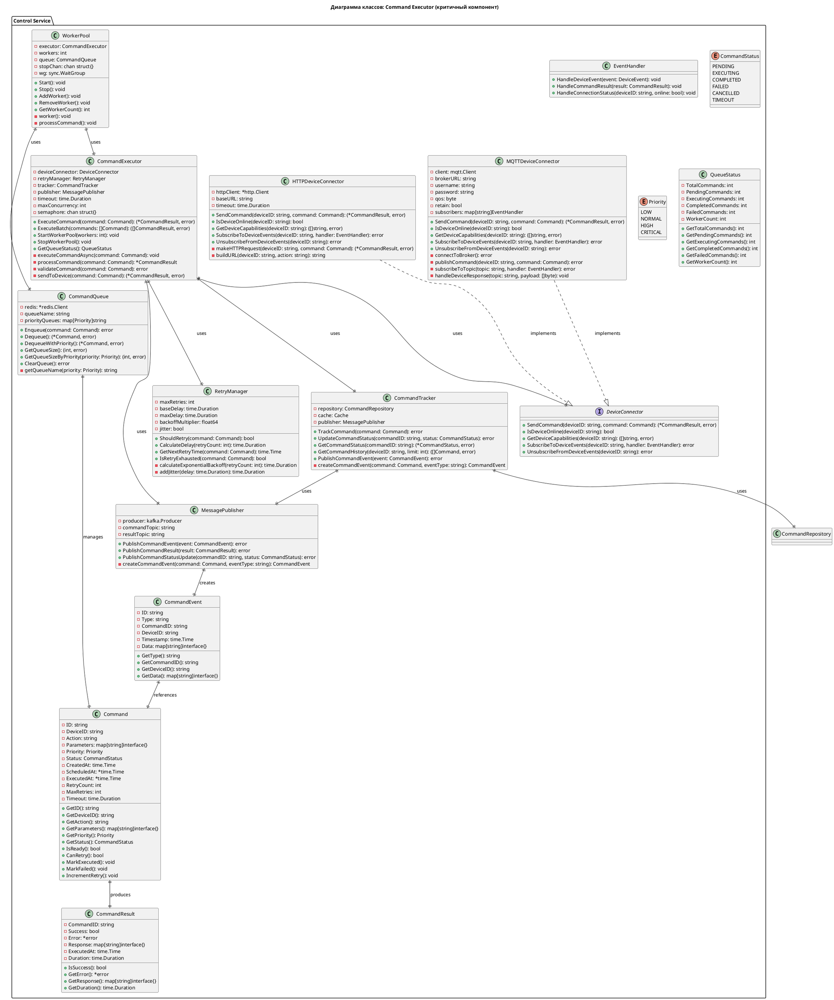

```puml
@startuml Command_Executor_Class_Diagram
title Диаграмма классов: Command Executor (критичный компонент)

package "Control Service" {
    
    ' Core Domain Models
    class Command {
        - ID: string
        - DeviceID: string
        - Action: string
        - Parameters: map[string]interface{}
        - Priority: Priority
        - Status: CommandStatus
        - CreatedAt: time.Time
        - ScheduledAt: *time.Time
        - ExecutedAt: *time.Time
        - RetryCount: int
        - MaxRetries: int
        - Timeout: time.Duration
        + GetID(): string
        + GetDeviceID(): string
        + GetAction(): string
        + GetParameters(): map[string]interface{}
        + GetPriority(): Priority
        + GetStatus(): CommandStatus
        + IsReady(): bool
        + CanRetry(): bool
        + MarkExecuted(): void
        + MarkFailed(): void
        + IncrementRetry(): void
    }
    
    class CommandResult {
        - CommandID: string
        - Success: bool
        - Error: *error
        - Response: map[string]interface{}
        - ExecutedAt: time.Time
        - Duration: time.Duration
        + IsSuccess(): bool
        + GetError(): *error
        + GetResponse(): map[string]interface{}
        + GetDuration(): time.Duration
    }
    
    ' Service Layer
    class CommandExecutor {
        - deviceConnector: DeviceConnector
        - retryManager: RetryManager
        - tracker: CommandTracker
        - publisher: MessagePublisher
        - timeout: time.Duration
        - maxConcurrency: int
        - semaphore: chan struct{}
        + ExecuteCommand(command: Command): (*CommandResult, error)
        + ExecuteBatch(commands: []Command): ([]CommandResult, error)
        + StartWorkerPool(workers: int): void
        + StopWorkerPool(): void
        + GetQueueStatus(): QueueStatus
        - executeCommandAsync(command: Command): void
        - processCommand(command: Command): *CommandResult
        - validateCommand(command: Command): error
        - sendToDevice(command: Command): (*CommandResult, error)
    }
    
    ' Device Connection Layer
    interface DeviceConnector {
        + SendCommand(deviceID: string, command: Command): (*CommandResult, error)
        + IsDeviceOnline(deviceID: string): bool
        + GetDeviceCapabilities(deviceID: string): ([]string, error)
        + SubscribeToDeviceEvents(deviceID: string, handler: EventHandler): error
        + UnsubscribeFromDeviceEvents(deviceID: string): error
    }
    
    class MQTTDeviceConnector {
        - client: mqtt.Client
        - brokerURL: string
        - username: string
        - password: string
        - qos: byte
        - retain: bool
        - subscribers: map[string]EventHandler
        + SendCommand(deviceID: string, command: Command): (*CommandResult, error)
        + IsDeviceOnline(deviceID: string): bool
        + GetDeviceCapabilities(deviceID: string): ([]string, error)
        + SubscribeToDeviceEvents(deviceID: string, handler: EventHandler): error
        + UnsubscribeFromDeviceEvents(deviceID: string): error
        - connectToBroker(): error
        - publishCommand(deviceID: string, command: Command): error
        - subscribeToTopic(topic: string, handler: EventHandler): error
        - handleDeviceResponse(topic: string, payload: []byte): void
    }
    
    class HTTPDeviceConnector {
        - httpClient: *http.Client
        - baseURL: string
        - timeout: time.Duration
        + SendCommand(deviceID: string, command: Command): (*CommandResult, error)
        + IsDeviceOnline(deviceID: string): bool
        + GetDeviceCapabilities(deviceID: string): ([]string, error)
        + SubscribeToDeviceEvents(deviceID: string, handler: EventHandler): error
        + UnsubscribeFromDeviceEvents(deviceID: string): error
        - makeHTTPRequest(deviceID: string, command: Command): (*CommandResult, error)
        - buildURL(deviceID: string, action: string): string
    }
    
    ' Retry Management
    class RetryManager {
        - maxRetries: int
        - baseDelay: time.Duration
        - maxDelay: time.Duration
        - backoffMultiplier: float64
        - jitter: bool
        + ShouldRetry(command: Command): bool
        + CalculateDelay(retryCount: int): time.Duration
        + GetNextRetryTime(command: Command): time.Time
        + IsRetryExhausted(command: Command): bool
        - calculateExponentialBackoff(retryCount: int): time.Duration
        - addJitter(delay: time.Duration): time.Duration
    }
    
    ' Command Tracking
    class CommandTracker {
        - repository: CommandRepository
        - cache: Cache
        - publisher: MessagePublisher
        + TrackCommand(command: Command): error
        + UpdateCommandStatus(commandID: string, status: CommandStatus): error
        + GetCommandStatus(commandID: string): (*CommandStatus, error)
        + GetCommandHistory(deviceID: string, limit: int): ([]Command, error)
        + PublishCommandEvent(event: CommandEvent): error
        - createCommandEvent(command: Command, eventType: string): CommandEvent
    }
    
    ' Message Publishing
    class MessagePublisher {
        - producer: kafka.Producer
        - commandTopic: string
        - resultTopic: string
        + PublishCommandEvent(event: CommandEvent): error
        + PublishCommandResult(result: CommandResult): error
        + PublishCommandStatusUpdate(commandID: string, status: CommandStatus): error
        - createCommandEvent(command: Command, eventType: string): CommandEvent
    }
    
    ' Event Handling
    class EventHandler {
        + HandleDeviceEvent(event: DeviceEvent): void
        + HandleCommandResult(result: CommandResult): void
        + HandleConnectionStatus(deviceID: string, online: bool): void
    }
    
    class CommandEvent {
        - ID: string
        - Type: string
        - CommandID: string
        - DeviceID: string
        - Timestamp: time.Time
        - Data: map[string]interface{}
        + GetType(): string
        + GetCommandID(): string
        + GetDeviceID(): string
        + GetData(): map[string]interface{}
    }
    
    ' Queue Management
    class CommandQueue {
        - redis: *redis.Client
        - queueName: string
        - priorityQueues: map[Priority]string
        + Enqueue(command: Command): error
        + Dequeue(): (*Command, error)
        + DequeueWithPriority(): (*Command, error)
        + GetQueueSize(): (int, error)
        + GetQueueSizeByPriority(priority: Priority): (int, error)
        + ClearQueue(): error
        - getQueueName(priority: Priority): string
    }
    
    ' Worker Pool
    class WorkerPool {
        - executor: CommandExecutor
        - workers: int
        - queue: CommandQueue
        - stopChan: chan struct{}
        - wg: sync.WaitGroup
        + Start(): void
        + Stop(): void
        + AddWorker(): void
        + RemoveWorker(): void
        + GetWorkerCount(): int
        - worker(): void
        - processCommand(): void
    }
    
    ' Status and Priority Enums
    enum CommandStatus {
        PENDING
        EXECUTING
        COMPLETED
        FAILED
        CANCELLED
        TIMEOUT
    }
    
    enum Priority {
        LOW
        NORMAL
        HIGH
        CRITICAL
    }
    
    ' DTOs
    class QueueStatus {
        - TotalCommands: int
        - PendingCommands: int
        - ExecutingCommands: int
        - CompletedCommands: int
        - FailedCommands: int
        - WorkerCount: int
        + GetTotalCommands(): int
        + GetPendingCommands(): int
        + GetExecutingCommands(): int
        + GetCompletedCommands(): int
        + GetFailedCommands(): int
        + GetWorkerCount(): int
    }
}

' Relationships
Command ||--|| CommandResult : produces
CommandExecutor ||--|| DeviceConnector : uses
CommandExecutor ||--|| RetryManager : uses
CommandExecutor ||--|| CommandTracker : uses
CommandExecutor ||--|| MessagePublisher : uses
MQTTDeviceConnector ..|> DeviceConnector : implements
HTTPDeviceConnector ..|> DeviceConnector : implements
CommandTracker ||--|| CommandRepository : uses
CommandTracker ||--|| MessagePublisher : uses
CommandQueue ||--|| Command : manages
WorkerPool ||--|| CommandExecutor : uses
WorkerPool ||--|| CommandQueue : uses
MessagePublisher ||--|| CommandEvent : creates
CommandEvent ||--|| Command : references
@enduml
```