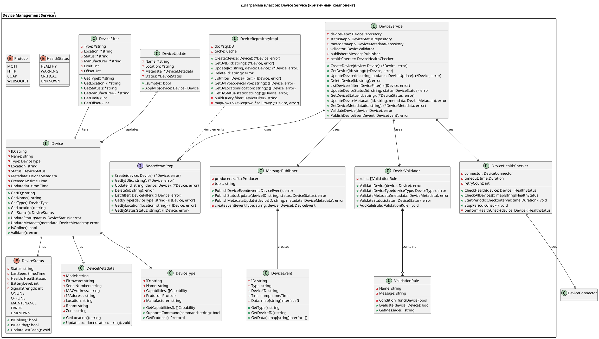

```puml
@startuml Device_Service_Class_Diagram
title Диаграмма классов: Device Service (критичный компонент)

package "Device Management Service" {
    
    ' Core Domain Models
    class Device {
        - ID: string
        - Name: string
        - Type: DeviceType
        - Location: string
        - Status: DeviceStatus
        - Metadata: DeviceMetadata
        - CreatedAt: time.Time
        - UpdatedAt: time.Time
        + GetID(): string
        + GetName(): string
        + GetType(): DeviceType
        + GetLocation(): string
        + GetStatus(): DeviceStatus
        + UpdateStatus(status: DeviceStatus): error
        + UpdateMetadata(metadata: DeviceMetadata): error
        + IsOnline(): bool
        + Validate(): error
    }
    
    class DeviceType {
        - ID: string
        - Name: string
        - Capabilities: []Capability
        - Protocol: Protocol
        - Manufacturer: string
        + GetCapabilities(): []Capability
        + SupportsCommand(command: string): bool
        + GetProtocol(): Protocol
    }
    
    class DeviceStatus {
        - Status: string
        - LastSeen: time.Time
        - Health: HealthStatus
        - BatteryLevel: int
        - SignalStrength: int
        + IsOnline(): bool
        + IsHealthy(): bool
        + UpdateLastSeen(): void
    }
    
    class DeviceMetadata {
        - Model: string
        - Firmware: string
        - SerialNumber: string
        - MACAddress: string
        - IPAddress: string
        - Location: string
        - Room: string
        - Zone: string
        + GetLocation(): string
        + UpdateLocation(location: string): void
    }
    
    ' Service Layer
    class DeviceService {
        - deviceRepo: DeviceRepository
        - statusRepo: DeviceStatusRepository
        - metadataRepo: DeviceMetadataRepository
        - validator: DeviceValidator
        - publisher: MessagePublisher
        - healthChecker: DeviceHealthChecker
        + CreateDevice(device: Device): (*Device, error)
        + GetDevice(id: string): (*Device, error)
        + UpdateDevice(id: string, updates: DeviceUpdate): (*Device, error)
        + DeleteDevice(id: string): error
        + ListDevices(filter: DeviceFilter): ([]Device, error)
        + UpdateDeviceStatus(id: string, status: DeviceStatus): error
        + GetDeviceStatus(id: string): (*DeviceStatus, error)
        + UpdateDeviceMetadata(id: string, metadata: DeviceMetadata): error
        + GetDeviceMetadata(id: string): (*DeviceMetadata, error)
        + ValidateDevice(device: Device): error
        + PublishDeviceEvent(event: DeviceEvent): error
    }
    
    ' Repository Layer
    interface DeviceRepository {
        + Create(device: Device): (*Device, error)
        + GetByID(id: string): (*Device, error)
        + Update(id: string, device: Device): (*Device, error)
        + Delete(id: string): error
        + List(filter: DeviceFilter): ([]Device, error)
        + GetByType(deviceType: string): ([]Device, error)
        + GetByLocation(location: string): ([]Device, error)
        + GetByStatus(status: string): ([]Device, error)
    }
    
    class DeviceRepositoryImpl {
        - db: *sql.DB
        - cache: Cache
        + Create(device: Device): (*Device, error)
        + GetByID(id: string): (*Device, error)
        + Update(id: string, device: Device): (*Device, error)
        + Delete(id: string): error
        + List(filter: DeviceFilter): ([]Device, error)
        + GetByType(deviceType: string): ([]Device, error)
        + GetByLocation(location: string): ([]Device, error)
        + GetByStatus(status: string): ([]Device, error)
        - buildQuery(filter: DeviceFilter): string
        - mapRowToDevice(row: *sql.Row): (*Device, error)
    }
    
    ' Validation Layer
    class DeviceValidator {
        - rules: []ValidationRule
        + ValidateDevice(device: Device): error
        + ValidateDeviceType(deviceType: DeviceType): error
        + ValidateMetadata(metadata: DeviceMetadata): error
        + ValidateStatus(status: DeviceStatus): error
        + AddRule(rule: ValidationRule): void
    }
    
    class ValidationRule {
        - Name: string
        - Condition: func(Device) bool
        - Message: string
        + Evaluate(device: Device): bool
        + GetMessage(): string
    }
    
    ' Health Check Layer
    class DeviceHealthChecker {
        - connector: DeviceConnector
        - timeout: time.Duration
        - retryCount: int
        + CheckHealth(device: Device): HealthStatus
        + CheckAllDevices(): map[string]HealthStatus
        + StartPeriodicCheck(interval: time.Duration): void
        + StopPeriodicCheck(): void
        - performHealthCheck(device: Device): HealthStatus
    }
    
    ' Message Publishing
    class MessagePublisher {
        - producer: kafka.Producer
        - topic: string
        + PublishDeviceEvent(event: DeviceEvent): error
        + PublishStatusUpdate(deviceID: string, status: DeviceStatus): error
        + PublishMetadataUpdate(deviceID: string, metadata: DeviceMetadata): error
        - createEvent(eventType: string, device: Device): DeviceEvent
    }
    
    class DeviceEvent {
        - ID: string
        - Type: string
        - DeviceID: string
        - Timestamp: time.Time
        - Data: map[string]interface{}
        + GetType(): string
        + GetDeviceID(): string
        + GetData(): map[string]interface{}
    }
    
    ' DTOs and Filters
    class DeviceUpdate {
        - Name: *string
        - Location: *string
        - Metadata: *DeviceMetadata
        - Status: *DeviceStatus
        + IsEmpty(): bool
        + ApplyTo(device: Device): Device
    }
    
    class DeviceFilter {
        - Type: *string
        - Location: *string
        - Status: *string
        - Manufacturer: *string
        - Limit: int
        - Offset: int
        + GetType(): *string
        + GetLocation(): *string
        + GetStatus(): *string
        + GetManufacturer(): *string
        + GetLimit(): int
        + GetOffset(): int
    }
    
    ' Enums
    enum DeviceStatus {
        ONLINE
        OFFLINE
        MAINTENANCE
        ERROR
        UNKNOWN
    }
    
    enum HealthStatus {
        HEALTHY
        WARNING
        CRITICAL
        UNKNOWN
    }
    
    enum Protocol {
        MQTT
        HTTP
        COAP
        WEBSOCKET
    }
}

' Relationships
Device ||--|| DeviceType : has
Device ||--|| DeviceStatus : has
Device ||--|| DeviceMetadata : has
DeviceService ||--|| DeviceRepository : uses
DeviceService ||--|| DeviceValidator : uses
DeviceService ||--|| MessagePublisher : uses
DeviceService ||--|| DeviceHealthChecker : uses
DeviceRepositoryImpl ..|> DeviceRepository : implements
DeviceValidator ||--o{ ValidationRule : contains
DeviceHealthChecker ||--|| DeviceConnector : uses
MessagePublisher ||--|| DeviceEvent : creates
DeviceUpdate ||--|| Device : updates
DeviceFilter ||--|| Device : filters

@enduml
```