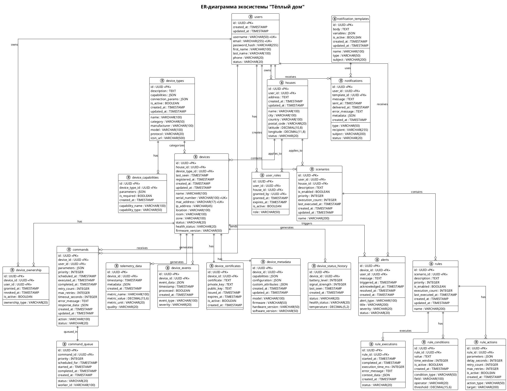

```puml
@startuml ER_Diagram_SmartHome
!theme plain
skinparam linetype ortho
skinparam backgroundColor #FFFFFF
skinparam entity {
    BackgroundColor #E1F5FE
    BorderColor #01579B
}
skinparam database {
    BackgroundColor #F3E5F5
    BorderColor #4A148C
}

title ER-диаграмма экосистемы "Тёплый дом"

' ==========================================
' IDENTITY & ACCOUNT DOMAIN
' ==========================================

entity users {
    id : UUID <<PK>>
    username : VARCHAR(50) <<UK>>
    email : VARCHAR(255) <<UK>>
    password_hash : VARCHAR(255)
    first_name : VARCHAR(100)
    last_name : VARCHAR(100)
    phone : VARCHAR(20)
    status : VARCHAR(20)
    created_at : TIMESTAMP
    updated_at : TIMESTAMP
}

entity houses {
    id : UUID <<PK>>
    user_id : UUID <<FK>>
    name : VARCHAR(100)
    address : TEXT
    city : VARCHAR(100)
    country : VARCHAR(100)
    postal_code : VARCHAR(20)
    latitude : DECIMAL(10,8)
    longitude : DECIMAL(11,8)
    status : VARCHAR(20)
    created_at : TIMESTAMP
    updated_at : TIMESTAMP
}

entity user_roles {
    id : UUID <<PK>>
    user_id : UUID <<FK>>
    role : VARCHAR(50)
    house_id : UUID <<FK>>
    granted_by : UUID <<FK>>
    granted_at : TIMESTAMP
    expires_at : TIMESTAMP
    is_active : BOOLEAN
}

' ==========================================
' DEVICE CATALOG & TYPES DOMAIN
' ==========================================

entity device_types {
    id : UUID <<PK>>
    name : VARCHAR(100)
    category : VARCHAR(50)
    manufacturer : VARCHAR(100)
    model : VARCHAR(100)
    description : TEXT
    protocol : VARCHAR(20)
    capabilities : JSON
    connection_params : JSON
    icon_url : VARCHAR(500)
    is_active : BOOLEAN
    created_at : TIMESTAMP
    updated_at : TIMESTAMP
}

entity device_capabilities {
    id : UUID <<PK>>
    device_type_id : UUID <<FK>>
    capability_name : VARCHAR(100)
    capability_type : VARCHAR(50)
    parameters : JSON
    is_required : BOOLEAN
    created_at : TIMESTAMP
}

' ==========================================
' DEVICE LIFECYCLE DOMAIN
' ==========================================

entity devices {
    id : UUID <<PK>>
    house_id : UUID <<FK>>
    device_type_id : UUID <<FK>>
    name : VARCHAR(100)
    serial_number : VARCHAR(100) <<UK>>
    mac_address : VARCHAR(17) <<UK>>
    ip_address : VARCHAR(45)
    location : VARCHAR(100)
    room : VARCHAR(100)
    zone : VARCHAR(100)
    status : VARCHAR(20)
    health_status : VARCHAR(20)
    firmware_version : VARCHAR(50)
    last_seen : TIMESTAMP
    registered_at : TIMESTAMP
    created_at : TIMESTAMP
    updated_at : TIMESTAMP
}

entity device_certificates {
    id : UUID <<PK>>
    device_id : UUID <<FK>>
    certificate : TEXT
    private_key : TEXT
    public_key : TEXT
    issued_at : TIMESTAMP
    expires_at : TIMESTAMP
    is_active : BOOLEAN
    created_at : TIMESTAMP
}

entity device_ownership {
    id : UUID <<PK>>
    device_id : UUID <<FK>>
    user_id : UUID <<FK>>
    ownership_type : VARCHAR(20)
    granted_at : TIMESTAMP
    revoked_at : TIMESTAMP
    is_active : BOOLEAN
}

' ==========================================
' DEVICE MANAGEMENT DOMAIN
' ==========================================

entity device_metadata {
    id : UUID <<PK>>
    device_id : UUID <<FK>>
    model : VARCHAR(100)
    firmware : VARCHAR(50)
    hardware_version : VARCHAR(50)
    software_version : VARCHAR(50)
    capabilities : JSON
    configuration : JSON
    custom_attributes : JSON
    created_at : TIMESTAMP
    updated_at : TIMESTAMP
}

entity device_status_history {
    id : UUID <<PK>>
    device_id : UUID <<FK>>
    status : VARCHAR(20)
    health_status : VARCHAR(20)
    battery_level : INTEGER
    signal_strength : INTEGER
    temperature : DECIMAL(5,2)
    last_seen : TIMESTAMP
    created_at : TIMESTAMP
}

' ==========================================
' CONTROL & ACTUATION DOMAIN
' ==========================================

entity commands {
    id : UUID <<PK>>
    device_id : UUID <<FK>>
    user_id : UUID <<FK>>
    action : VARCHAR(100)
    parameters : JSON
    priority : INTEGER
    status : VARCHAR(20)
    scheduled_at : TIMESTAMP
    executed_at : TIMESTAMP
    completed_at : TIMESTAMP
    retry_count : INTEGER
    max_retries : INTEGER
    timeout_seconds : INTEGER
    error_message : TEXT
    response_data : JSON
    created_at : TIMESTAMP
    updated_at : TIMESTAMP
}

entity command_queue {
    id : UUID <<PK>>
    command_id : UUID <<FK>>
    priority : INTEGER
    status : VARCHAR(20)
    scheduled_for : TIMESTAMP
    started_at : TIMESTAMP
    completed_at : TIMESTAMP
    worker_id : VARCHAR(100)
    created_at : TIMESTAMP
}

' ==========================================
' TELEMETRY & MONITORING DOMAIN
' ==========================================

entity telemetry_data {
    id : UUID <<PK>>
    device_id : UUID <<FK>>
    metric_name : VARCHAR(100)
    metric_value : DECIMAL(15,6)
    metric_unit : VARCHAR(20)
    timestamp : TIMESTAMP
    quality : VARCHAR(20)
    metadata : JSON
    created_at : TIMESTAMP
}

entity device_events {
    id : UUID <<PK>>
    device_id : UUID <<FK>>
    event_type : VARCHAR(100)
    event_data : JSON
    severity : VARCHAR(20)
    timestamp : TIMESTAMP
    processed : BOOLEAN
    created_at : TIMESTAMP
}

entity alerts {
    id : UUID <<PK>>
    device_id : UUID <<FK>>
    user_id : UUID <<FK>>
    alert_type : VARCHAR(100)
    title : VARCHAR(200)
    message : TEXT
    severity : VARCHAR(20)
    status : VARCHAR(20)
    triggered_at : TIMESTAMP
    acknowledged_at : TIMESTAMP
    resolved_at : TIMESTAMP
    created_at : TIMESTAMP
}

' ==========================================
' AUTOMATION & SCENARIOS DOMAIN
' ==========================================

entity scenarios {
    id : UUID <<PK>>
    user_id : UUID <<FK>>
    house_id : UUID <<FK>>
    name : VARCHAR(200)
    description : TEXT
    is_enabled : BOOLEAN
    priority : INTEGER
    execution_count : INTEGER
    last_executed_at : TIMESTAMP
    created_at : TIMESTAMP
    updated_at : TIMESTAMP
}

entity rules {
    id : UUID <<PK>>
    scenario_id : UUID <<FK>>
    name : VARCHAR(200)
    description : TEXT
    priority : INTEGER
    is_enabled : BOOLEAN
    execution_count : INTEGER
    last_executed_at : TIMESTAMP
    created_at : TIMESTAMP
    updated_at : TIMESTAMP
}

entity rule_conditions {
    id : UUID <<PK>>
    rule_id : UUID <<FK>>
    condition_type : VARCHAR(50)
    field : VARCHAR(100)
    operator : VARCHAR(20)
    value : TEXT
    threshold : DECIMAL(15,6)
    time_window : INTEGER
    is_active : BOOLEAN
    created_at : TIMESTAMP
}

entity rule_actions {
    id : UUID <<PK>>
    rule_id : UUID <<FK>>
    action_type : VARCHAR(50)
    target : VARCHAR(200)
    parameters : JSON
    delay_seconds : INTEGER
    retry_count : INTEGER
    max_retries : INTEGER
    is_active : BOOLEAN
    created_at : TIMESTAMP
}

entity rule_executions {
    id : UUID <<PK>>
    rule_id : UUID <<FK>>
    status : VARCHAR(20)
    started_at : TIMESTAMP
    completed_at : TIMESTAMP
    execution_time_ms : INTEGER
    error_message : TEXT
    context_data : JSON
    created_at : TIMESTAMP
}

' ==========================================
' NOTIFICATION DOMAIN
' ==========================================

entity notification_templates {
    id : UUID <<PK>>
    name : VARCHAR(100)
    type : VARCHAR(50)
    subject : VARCHAR(200)
    body : TEXT
    variables : JSON
    is_active : BOOLEAN
    created_at : TIMESTAMP
    updated_at : TIMESTAMP
}

entity notifications {
    id : UUID <<PK>>
    user_id : UUID <<FK>>
    template_id : UUID <<FK>>
    type : VARCHAR(50)
    recipient : VARCHAR(255)
    subject : VARCHAR(200)
    message : TEXT
    status : VARCHAR(20)
    sent_at : TIMESTAMP
    delivered_at : TIMESTAMP
    error_message : TEXT
    metadata : JSON
    created_at : TIMESTAMP
}

' ==========================================
' RELATIONSHIPS
' ==========================================

' Identity & Account relationships
users ||--o{ houses : owns
users ||--o{ user_roles : has
houses ||--o{ user_roles : applies_to

' Device Catalog relationships
device_types ||--o{ device_capabilities : has
device_types ||--o{ devices : categorizes

' Device Lifecycle relationships
houses ||--o{ devices : contains
devices ||--|| device_certificates : has
devices ||--o{ device_ownership : has
users ||--o{ device_ownership : owns

' Device Management relationships
devices ||--|| device_metadata : has
devices ||--o{ device_status_history : generates

' Control relationships
devices ||--o{ commands : receives
users ||--o{ commands : sends
commands ||--|| command_queue : queued_in

' Telemetry relationships
devices ||--o{ telemetry_data : generates
devices ||--o{ device_events : generates
devices ||--o{ alerts : triggers
users ||--o{ alerts : receives

' Automation relationships
users ||--o{ scenarios : creates
houses ||--o{ scenarios : applies_to
scenarios ||--o{ rules : contains
rules ||--o{ rule_conditions : has
rules ||--o{ rule_actions : has
rules ||--o{ rule_executions : executes

' Notification relationships
users ||--o{ notifications : receives
notification_templates ||--o{ notifications : uses

@enduml
```