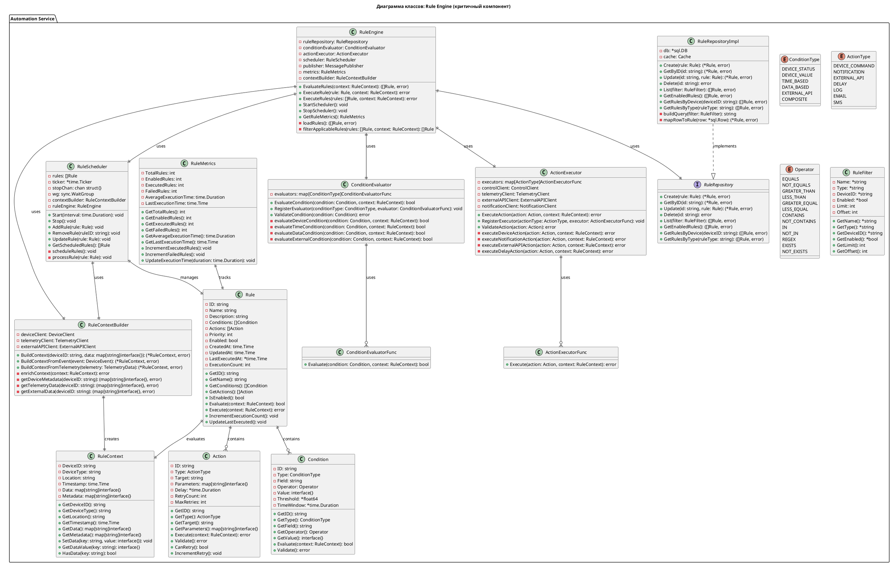

```puml
@startuml Rule_Engine_Class_Diagram
title Диаграмма классов: Rule Engine (критичный компонент)

package "Automation Service" {
    
    ' Core Domain Models
    class Rule {
        - ID: string
        - Name: string
        - Description: string
        - Conditions: []Condition
        - Actions: []Action
        - Priority: int
        - Enabled: bool
        - CreatedAt: time.Time
        - UpdatedAt: time.Time
        - LastExecutedAt: *time.Time
        - ExecutionCount: int
        + GetID(): string
        + GetName(): string
        + GetConditions(): []Condition
        + GetActions(): []Action
        + IsEnabled(): bool
        + Evaluate(context: RuleContext): bool
        + Execute(context: RuleContext): error
        + IncrementExecutionCount(): void
        + UpdateLastExecuted(): void
    }
    
    class Condition {
        - ID: string
        - Type: ConditionType
        - Field: string
        - Operator: Operator
        - Value: interface{}
        - Threshold: *float64
        - TimeWindow: *time.Duration
        + GetID(): string
        + GetType(): ConditionType
        + GetField(): string
        + GetOperator(): Operator
        + GetValue(): interface{}
        + Evaluate(context: RuleContext): bool
        + Validate(): error
    }
    
    class Action {
        - ID: string
        - Type: ActionType
        - Target: string
        - Parameters: map[string]interface{}
        - Delay: *time.Duration
        - RetryCount: int
        - MaxRetries: int
        + GetID(): string
        + GetType(): ActionType
        + GetTarget(): string
        + GetParameters(): map[string]interface{}
        + Execute(context: RuleContext): error
        + Validate(): error
        + CanRetry(): bool
        + IncrementRetry(): void
    }
    
    class RuleContext {
        - DeviceID: string
        - DeviceType: string
        - Location: string
        - Timestamp: time.Time
        - Data: map[string]interface{}
        - Metadata: map[string]interface{}
        + GetDeviceID(): string
        + GetDeviceType(): string
        + GetLocation(): string
        + GetTimestamp(): time.Time
        + GetData(): map[string]interface{}
        + GetMetadata(): map[string]interface{}
        + SetData(key: string, value: interface{}): void
        + GetDataValue(key: string): interface{}
        + HasData(key: string): bool
    }
    
    ' Rule Engine Core
    class RuleEngine {
        - ruleRepository: RuleRepository
        - conditionEvaluator: ConditionEvaluator
        - actionExecutor: ActionExecutor
        - scheduler: RuleScheduler
        - publisher: MessagePublisher
        - metrics: RuleMetrics
        - contextBuilder: RuleContextBuilder
        + EvaluateRules(context: RuleContext): ([]Rule, error)
        + ExecuteRule(rule: Rule, context: RuleContext): error
        + ExecuteRules(rules: []Rule, context: RuleContext): error
        + StartScheduler(): void
        + StopScheduler(): void
        + GetRuleMetrics(): RuleMetrics
        - loadRules(): ([]Rule, error)
        - filterApplicableRules(rules: []Rule, context: RuleContext): []Rule
    }
    
    ' Condition Evaluation
    class ConditionEvaluator {
        - evaluators: map[ConditionType]ConditionEvaluatorFunc
        + EvaluateCondition(condition: Condition, context: RuleContext): bool
        + RegisterEvaluator(conditionType: ConditionType, evaluator: ConditionEvaluatorFunc): void
        + ValidateCondition(condition: Condition): error
        - evaluateDeviceCondition(condition: Condition, context: RuleContext): bool
        - evaluateTimeCondition(condition: Condition, context: RuleContext): bool
        - evaluateDataCondition(condition: Condition, context: RuleContext): bool
        - evaluateExternalCondition(condition: Condition, context: RuleContext): bool
    }
    
    class ConditionEvaluatorFunc {
        + Evaluate(condition: Condition, context: RuleContext): bool
    }
    
    ' Action Execution
    class ActionExecutor {
        - executors: map[ActionType]ActionExecutorFunc
        - controlClient: ControlClient
        - telemetryClient: TelemetryClient
        - externalAPIClient: ExternalAPIClient
        - notificationClient: NotificationClient
        + ExecuteAction(action: Action, context: RuleContext): error
        + RegisterExecutor(actionType: ActionType, executor: ActionExecutorFunc): void
        + ValidateAction(action: Action): error
        - executeDeviceAction(action: Action, context: RuleContext): error
        - executeNotificationAction(action: Action, context: RuleContext): error
        - executeExternalAPIAction(action: Action, context: RuleContext): error
        - executeDelayAction(action: Action, context: RuleContext): error
    }
    
    class ActionExecutorFunc {
        + Execute(action: Action, context: RuleContext): error
    }
    
    ' Rule Scheduling
    class RuleScheduler {
        - rules: []Rule
        - ticker: *time.Ticker
        - stopChan: chan struct{}
        - wg: sync.WaitGroup
        - contextBuilder: RuleContextBuilder
        - ruleEngine: RuleEngine
        + Start(interval: time.Duration): void
        + Stop(): void
        + AddRule(rule: Rule): void
        + RemoveRule(ruleID: string): void
        + UpdateRule(rule: Rule): void
        + GetScheduledRules(): []Rule
        - scheduleRules(): void
        - processRule(rule: Rule): void
    }
    
    ' Context Building
    class RuleContextBuilder {
        - deviceClient: DeviceClient
        - telemetryClient: TelemetryClient
        - externalAPIClient: ExternalAPIClient
        + BuildContext(deviceID: string, data: map[string]interface{}): (*RuleContext, error)
        + BuildContextFromEvent(event: DeviceEvent): (*RuleContext, error)
        + BuildContextFromTelemetry(telemetry: TelemetryData): (*RuleContext, error)
        - enrichContext(context: RuleContext): error
        - getDeviceMetadata(deviceID: string): (map[string]interface{}, error)
        - getTelemetryData(deviceID: string): (map[string]interface{}, error)
        - getExternalData(deviceID: string): (map[string]interface{}, error)
    }
    
    ' Rule Repository
    interface RuleRepository {
        + Create(rule: Rule): (*Rule, error)
        + GetByID(id: string): (*Rule, error)
        + Update(id: string, rule: Rule): (*Rule, error)
        + Delete(id: string): error
        + List(filter: RuleFilter): ([]Rule, error)
        + GetEnabledRules(): ([]Rule, error)
        + GetRulesByDevice(deviceID: string): ([]Rule, error)
        + GetRulesByType(ruleType: string): ([]Rule, error)
    }
    
    class RuleRepositoryImpl {
        - db: *sql.DB
        - cache: Cache
        + Create(rule: Rule): (*Rule, error)
        + GetByID(id: string): (*Rule, error)
        + Update(id: string, rule: Rule): (*Rule, error)
        + Delete(id: string): error
        + List(filter: RuleFilter): ([]Rule, error)
        + GetEnabledRules(): ([]Rule, error)
        + GetRulesByDevice(deviceID: string): ([]Rule, error)
        + GetRulesByType(ruleType: string): ([]Rule, error)
        - buildQuery(filter: RuleFilter): string
        - mapRowToRule(row: *sql.Row): (*Rule, error)
    }
    
    ' Metrics and Monitoring
    class RuleMetrics {
        - TotalRules: int
        - EnabledRules: int
        - ExecutedRules: int
        - FailedRules: int
        - AverageExecutionTime: time.Duration
        - LastExecutionTime: time.Time
        + GetTotalRules(): int
        + GetEnabledRules(): int
        + GetExecutedRules(): int
        + GetFailedRules(): int
        + GetAverageExecutionTime(): time.Duration
        + GetLastExecutionTime(): time.Time
        + IncrementExecutedRules(): void
        + IncrementFailedRules(): void
        + UpdateExecutionTime(duration: time.Duration): void
    }
    
    ' Enums
    enum ConditionType {
        DEVICE_STATUS
        DEVICE_VALUE
        TIME_BASED
        DATA_BASED
        EXTERNAL_API
        COMPOSITE
    }
    
    enum ActionType {
        DEVICE_COMMAND
        NOTIFICATION
        EXTERNAL_API
        DELAY
        LOG
        EMAIL
        SMS
    }
    
    enum Operator {
        EQUALS
        NOT_EQUALS
        GREATER_THAN
        LESS_THAN
        GREATER_EQUAL
        LESS_EQUAL
        CONTAINS
        NOT_CONTAINS
        IN
        NOT_IN
        REGEX
        EXISTS
        NOT_EXISTS
    }
    
    ' DTOs
    class RuleFilter {
        - Name: *string
        - Type: *string
        - DeviceID: *string
        - Enabled: *bool
        - Limit: int
        - Offset: int
        + GetName(): *string
        + GetType(): *string
        + GetDeviceID(): *string
        + GetEnabled(): *bool
        + GetLimit(): int
        + GetOffset(): int
    }
}

' Relationships
Rule ||--o{ Condition : contains
Rule ||--o{ Action : contains
Rule ||--|| RuleContext : evaluates
ConditionEvaluator ||--o{ ConditionEvaluatorFunc : uses
ActionExecutor ||--o{ ActionExecutorFunc : uses
RuleEngine ||--|| RuleRepository : uses
RuleEngine ||--|| ConditionEvaluator : uses
RuleEngine ||--|| ActionExecutor : uses
RuleEngine ||--|| RuleScheduler : uses
RuleEngine ||--|| RuleContextBuilder : uses
RuleScheduler ||--|| Rule : manages
RuleScheduler ||--|| RuleContextBuilder : uses
RuleRepositoryImpl ..|> RuleRepository : implements
RuleContextBuilder ||--|| RuleContext : creates
RuleMetrics ||--|| Rule : tracks

@enduml
```